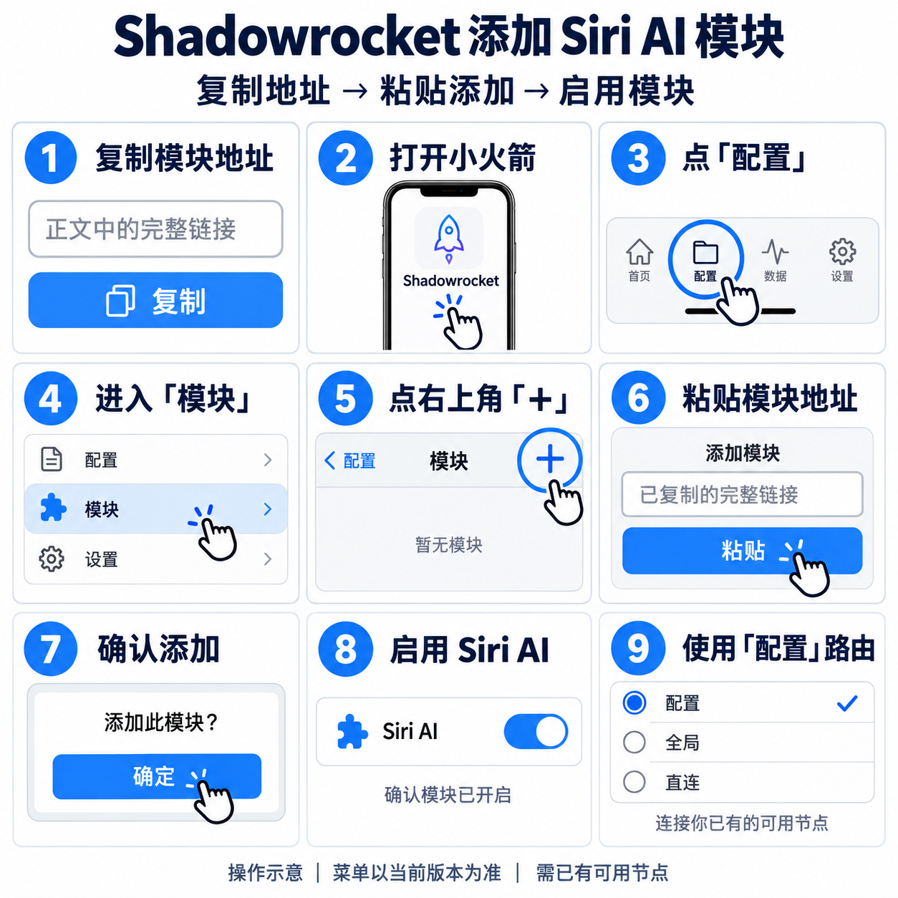

# Shadowrocket：复制地址，添加模块

## 安装模块

**先复制下面这一整行模块地址：**

```text
https://raw.githubusercontent.com/BrownieCoder/SiriAI-RouteKit/6bce8d5563cd13aef913035971decab4890fc267/modules/siri-ai.module
```

然后照图操作：**打开小火箭 → 配置 → 模块 → ＋ → 粘贴地址 → 确认添加 → 启用。**



这是操作示意图，菜单以当前版本为准。需要已经安装 Shadowrocket 并有可用节点；添加后确认模块开启，首页“全局路由”使用“配置”，连接已有节点即可开始使用这些分流规则。

**不替换你的节点或主配置，不需要安装证书。** 规则只调整指定连接的出口，不代表获得 Siri AI 使用资格。已有自定义拦截规则的用户，先看下方冲突说明。

### 粘贴后没有添加成功？

先检查是否复制了完整地址、当前网络能否打开它。仍下载失败时，可以打开[模块文件](../modules/siri-ai.module)，复制完整内容，在“配置 → 模块 → 新建模块”中整块粘贴保存，不用逐条输入域名。

当前固定版本地址已核对可下载；一键安装网页尚未上线。菜单和模块协议依据来自[社区手册](https://github.com/LOWERTOP/Shadowrocket)，本项目尚未进行客户端真机导入。[详细依据](客户端导入能力.md)。

## 会不会影响原来的规则？

主配置、节点和原有规则文件都保留。模块会覆盖主配置对这 5 个精确目标的路由选择，`guzzoni.apple.com` 的传统 Siri/听写也会一起改变出口。

社区手册说明模块规则优先于主配置，所以可以先于主配置中的宽泛 Apple/China/CDN/Global 规则命中。**这也可能先于主配置里对同一目标的拒绝规则。** 已有安全拦截要求或其他模块冲突时，不要直接启用本模块；先核对模块顺序和规则测试，保留安全拦截优先。模块无法替你推断私人配置，也不会重排它。

安装后在“配置 → 测试规则”用[生成的域名清单](../rules/domains.txt)逐一检查；预期命中本模块的精确规则和 `PROXY`，不要被更早的其他模块截走。再发一次不含个人信息的请求，在连接记录中核对实际规则、策略及 TCP/UDP。静态校验不证明真机命中或请求成功。

<a id="最简单的做法在配置副本加-5-条规则"></a>
## 手动添加备用

只在模块无法安装或与你的安全规则冲突时使用。先复制当前配置，保留原配置便于回退。

1. 从[自动生成的模块](../modules/siri-ai.module)取得 `[Rule]` 下的 5 条 `DOMAIN,…,PROXY`。不要把文件头或 `[Rule]` 标记粘成规则，也不要改成宽后缀。
2. 在配置副本的规则编辑器添加这些规则；纯文本编辑时只把规则行放进已有 `[Rule]` 段，不能替换全部内容。
3. 将它们放在宽泛 Apple/China/CDN/Global 之前，安全/拒绝规则之后。保留原来的 FINAL，保存、编译并使用副本，再测试匹配。

如果当前界面只支持逐条输入，类型选 `DOMAIN`，策略选 `PROXY`，域名以模块为准。本教程不另抄一套域名名单。

## 使用文件或纯文本

[modules/siri-ai.module](../modules/siri-ai.module)是安装用的独立模块。

[rules/shadowrocket.list](../rules/shadowrocket.list)是两字段规则集，供 `RULE-SET` 使用，不能直接作为模块安装；放进 `[Rule]` 时需第三字段策略。

[examples/shadowrocket.conf](../examples/shadowrocket.conf)是完整演示配置，包含 `FINAL,DIRECT`，启用后所有未命中流量直连。它不适合替换日常配置，优先安装模块。

## 回退与排查

关闭或移除 Siri AI 模块，再按客户端提示重新加载配置；手动添加的副本可切回原配置。仅切换主配置不一定关闭仍启用的模块。

规则命中仍不能用时，先按[排障指南](排障指南.md)查资格、模型与开放状态，再查实际出口和 DNS。PCC 相关入口包含 UDP/443，需兼容的出口；不要默认屏蔽 QUIC 就一定成功。[Apple 网络主机清单](https://support.apple.com/en-us/101555)。
